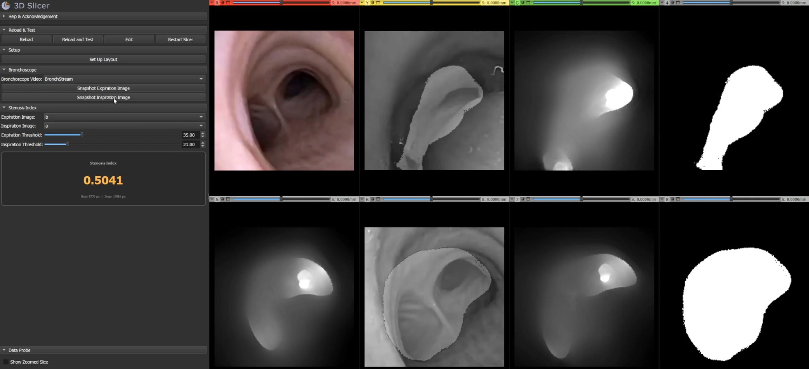

# Airway Stenosis Quantification — v2.0

A 3D Slicer module for real-time airway stenosis index estimation from bronchoscopic video using cGAN-based depth estimation.

This is a rewrite of the [v1.0 module](../1.0/README.md), with live bronchoscope integration and interactive threshold controls.



## Requirements

- **3D Slicer** 5.x
- **Python packages** (install via the Slicer Python console):

```python
slicer.util.pip_install("torch torchvision torchaudio")
slicer.util.pip_install("Pillow")
```

## Model Weights

The depth estimation model is currently not included in version control due to file size. Place it in `2.0/Models/` before use.

## Usage

### Setup

1. Open the module in Slicer. The depth estimation model loads automatically on startup.

### Live Bronchoscope

1. Connect your bronchoscope video feed via OpenIGTLink (configured separately).
2. Select the incoming video volume in the **Bronchoscope Video** combo box. A depth map is generated in real-time as the video updates.
3. When you see the desired frame:
   - Click **Snapshot Expiration Image** to capture the current frame as the expiration image.
   - Click **Snapshot Inspiration Image** to capture the current frame as the inspiration image.
   - Snapshots are automatically converted to grayscale.
4. Click **Set Up Layout** in the Startup section to arrange the viewer into a 4x2 slice layout with all relevant views pre-assigned.

### Stenosis Index

1. Select (or snapshot) volumes in the **Expiration Image** and **Inspiration Image** combo boxes. Depth maps are generated automatically when an image is set or updated.
2. Adjust the **Expiration Threshold** and **Inspiration Threshold** sliders to control the depth segmentation. Threshold images update in real-time.
3. The **Stenosis Index** display updates automatically, showing:
   - The SI value
   - The pixel counts for both expiration and inspiration

Threshold images are also overlaid on the expiration/inspiration image views.

## Stenosis Index Formula

```
SI = 1 - (expiration_pixels / inspiration_pixels)
```

Where pixel counts are the number of pixels in each depth map exceeding their respective threshold value (× 2).
